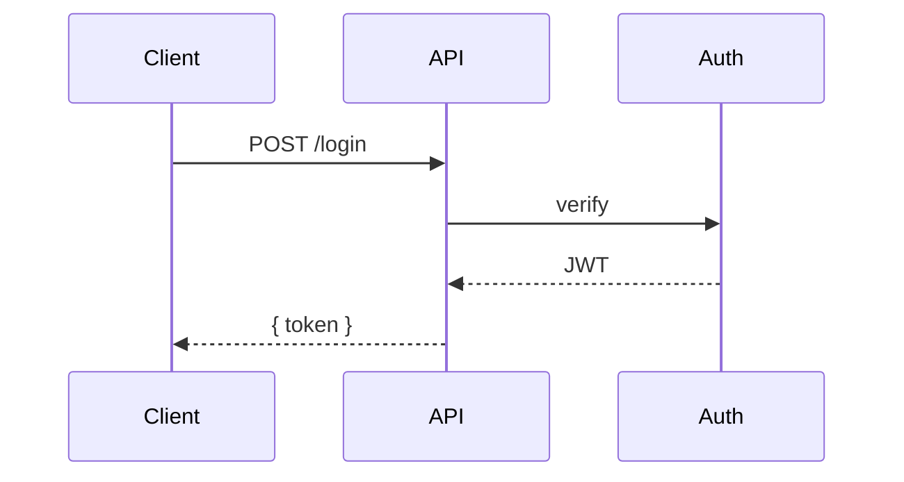

# Decision Tool — Specification

> Status: Draft v1 · Owner: Lindsen Cruz · Last updated: 2026-05-15

## 1. Overview

A **desktop application** (Tauri-based) for facilitating structured technical decisions in team meetings. The app's role is to make the deliberation visible (problem, candidate solutions, criteria, scoring) and to produce a portable markdown artifact that captures the decision for future readers.

The app is designed for one facilitator operating it during a meeting (screen-shared), with no multi-user collaboration. The markdown file on disk is the source of truth; the app is one of several tools (alongside VS Code and Claude Code/Desktop) that read and write it. Tauri's Rust backend owns file IO and watching; the React renderer is the UI.

## 2. Goals

| # | Goal |
|---|------|
| G1 | Present a problem and candidate solutions in a meeting-friendly walkthrough format. |
| G2 | Capture each solution's compliance with required criteria and preferred criteria. |
| G3 | Eliminate solutions that fail any required criterion; rank surviving solutions by count of preferred criteria met. |
| G4 | Support live iteration during a meeting — add/edit/remove criteria, rescore — with sub-100ms UI feedback. |
| G5 | Persist every session as a single markdown file readable by humans, by LLMs, and by the app. |
| G6 | Allow the user to drive content edits via an external Claude (Code or Desktop) session, with the app reflecting those edits live. |
| G7 | Enable resuming a session at any later date by re-opening its `.md` file. |

## 3. Non-goals

| # | Non-goal |
|---|---------|
| N1 | Real-time multi-user collaborative editing. |
| N2 | Authentication, accounts, or hosted multi-tenant deployment. |
| N3 | In-app chat with an LLM. (Future: pluggable.) |
| N4 | Slide-deck export to PDF or PowerPoint. |
| N5 | Quantitative methods beyond a simple count of met preferred criteria (e.g., weighted sums, AHP, Bayesian, sensitivity analysis). |
| N6 | Mobile or tablet support. |

## 4. User stories

| ID | As a... | I want to... | So that... |
|----|---------|--------------|-----------|
| US1 | facilitator | open the app and create a new decision session | I can start a structured deliberation in under 30 seconds |
| US2 | facilitator | walk my team through the problem statement and each candidate solution | everyone has shared context before scoring |
| US3 | facilitator | define required and preferred criteria | the team agrees on the rubric before evaluating |
| US4 | facilitator | toggle each solution's compliance with each criterion live during discussion | the matrix reflects consensus in real time |
| US5 | facilitator | see which solutions are eliminated and which are leading | the team can converge on a decision |
| US6 | facilitator | flip between "presenting" and "scoring" views in one keystroke | I can answer a question about a solution mid-scoring without losing context |
| US7 | facilitator | ask Claude (in a separate window) to draft a problem statement or suggest criteria | I get AI help on slow, creative tasks without slowing down the fast scoring loop |
| US8 | future developer | read the markdown file months later | I can understand why the team picked what they picked |
| US9 | facilitator | resume an in-progress decision the next day | meetings can span multiple sessions |

## 5. System architecture

```
+--------------------------------------------------------------+
|  Tauri desktop application (single process)                  |
|  +-------------------------------+  +---------------------+  |
|  |  React renderer (webview)     |  |  Rust core           | |
|  |  - Presentation tab           |◀▶|  - commands (IPC)    | |
|  |  - Decision tab               |  |  - notify watcher    | |
|  |  - TanStack Router + Query    |  |  - parser*           | |
|  |  - Zustand                    |  |                      | |
|  +-------------------------------+  +----------+-----------+  |
+----------------------------------------------------|---------+
                                                     | fs I/O + notify
                                                     v
                                          +-------------------+
                                          | <user folder>/*.md|
                                          | (default: ~/decisions) |
                                          +-------------------+
                                                     ^
                                                     | external edits
                                          +-------------------+
                                          | Claude Code,      |
                                          | Claude Desktop,   |
                                          | VS Code, etc.     |
                                          +-------------------+
```

\* The markdown parser/serializer runs in the renderer (TypeScript via `unified` + `remark-*`) — it's isomorphic and avoids duplicating the implementation in Rust. The Rust core's only responsibilities are raw file IO, atomic writes, watching, and the optimistic-concurrency hash check.

The renderer, the Rust core, and external editors all converge on the user-chosen markdown folder. The Rust `notify` watcher + Tauri event bus ensures any external edit propagates to the renderer within ~100ms. Single process — no HTTP, no port, no network egress.

## 6. Domain model

### 6.1 Entities

A **Session** represents one decision being made.

| Entity | Identity | Fields |
|--------|----------|--------|
| `Session` | filename slug | `meta`, `title`, `problem`, `solutions[]`, `criteria[]`, `scores[]`, `decision`, `history[]` |
| `SessionMeta` | — | `schema: "decision/v1"`, `slug`, `created`, `updated`, `status` |
| `Solution` | internal UUID + visible `name` | `id`, `name`, `description`, `pros[]`, `cons[]` |
| `Criterion` | visible `id` (e.g. `C1`) | `id`, `name`, `type`, `contested` |
| `ScoreCell` | (`solutionId`, `criterionId`) | `value` ∈ {`yes`, `no`, `unknown`} |
| `HistoryEntry` | timestamp | `timestamp`, `message` |

### 6.2 Field rules

| Field | Rule |
|-------|------|
| `SessionMeta.status` | One of `draft`, `in-progress`, `decided`, `archived`. |
| `SessionMeta.created`, `SessionMeta.updated` | ISO 8601 UTC. `updated` is set on every in-app save. |
| `Criterion.type` | `Required` or `Preferred`. |
| `Criterion.contested` | Boolean. `true` marks the criterion as not having team consensus. Orthogonal to `type` — a contested Required criterion still gates elimination. Contested criteria sort to the bottom of the matrix and carry a yellow chip in the UI. Default: `false`. |
| `ScoreCell.value` | Defaults to `unknown` (sparse: missing cells imply `unknown`). |
| `Solution.id` | Stable across renames; minted at parse time. Not serialized to markdown. |
| `Criterion.id` | Stable across renames; written to markdown as a visible column header. |

### 6.3 Derived values

| Value | Formula |
|-------|---------|
| `isSurviving(s)` | `true` iff no `Required` criterion has `score(s, c) = no` |
| `score(s)` | count of `Preferred` criteria where `score(s, c) = yes` |
| `maxScore` | total count of `Preferred` criteria |
| `unknownCount(s)` | count of `Preferred` cells for solution `s` with value `unknown` |
| `isScoringComplete` | no surviving solution has any `unknown` cell |
| `recommendation` | the surviving solution with the highest `score(s)`; tie-break by original order |

## 7. File format specification (`decisions/<slug>.md`)

### 7.1 Structure

A decision file is a markdown document with YAML frontmatter and exactly two top-level `# ` sections — **`# Presentation`** and **`# Decision`** — mirroring the app's two tabs. The document title lives in frontmatter; no document-level H1 is used.

```markdown
---
schema: decision/v1
slug: <slug>
title: <Document title>
status: draft | in-progress | decided | archived
created: <ISO 8601>
updated: <ISO 8601>
---

# Presentation

## Problem
<markdown body — renders as the Problem slide>

## Solutions

### <Solution name>
<markdown description, optional image, pros/cons, code, mermaid — renders as one slide>

**Pros**
- <bullet>

**Cons**
- <bullet>

### <Next solution name>
...

# Decision

## Criteria

| ID | Name | Type | Contested |
| -- | ---- | ---- | --------- |
| C1 | <name> | Required | |
| C2 | <name> | Preferred | |
| C3 | <name> | Preferred | yes |

## Scores

|              | <Solution 1> | <Solution 2> |
| ------------ | ------------ | ------------ |
| C1: <name>   | ✓            | ?            |
| C2: <name>   | ✗            | ✓            |

## Decision
<markdown body>

## History
- 2026-05-15T14:23:11Z — Created session
- 2026-05-15T14:51:02Z — Added solution: <name>
```

### 7.1.0 Blank template

When the user invokes "+ New decision" (FR-shell-7), the Rust core writes a fresh `.md` file with the following content. The slug and timestamps are filled per-instance; everything else is verbatim.

```markdown
---
schema: decision/v1
slug: <slug>
title: Untitled decision
status: draft
created: <ISO 8601 now>
updated: <ISO 8601 now>
---

# Presentation

## Problem

## Solutions

# Decision

## Criteria

| ID | Name | Type | Contested |
|----|------|------|-----------|

## Scores

| Solution |
|----------|

## Decision

## History

- <ISO 8601 now> — Created session
```

Empty sections, empty tables, one history entry. The parser handles every empty section gracefully (§7.5); the UI renders empty states per FR-empty-*.

### 7.1.1 Section-to-UI mapping

Each top-level section is routed to a specific UI surface by its heading. This is the schema's contract — there is no per-element directive to mark content as "for the slide" vs "for the matrix."

| Section (or frontmatter) | Presentation tab | Decision tab |
|--------------------------|------------------|--------------|
| Frontmatter (`title`, `status`, `slug`, `created`, `updated`) | App shell header | App shell header |
| `# Title` (document H1) | Shown on the Problem slide as the deck title | Shown in app shell header |
| `## Problem` (body) | Problem slide (sole content) | — |
| `## Solutions` → `### <name>` (heading text) | Slide title for that solution | Row label in the Scoring matrix |
| `## Solutions` → `### <name>` (body, including description, `**Pros**` / `**Cons**` lists, images, code blocks, mermaid diagrams) | Solution slide body | — |
| `## Criteria` (table) | — | Criteria editor |
| `## Scores` (table) | — | Scoring matrix cells |
| `## Decision` (body) | — | Decision summary section |
| `## History` (list) | — | Footer (collapsible, default collapsed) |
| Unknown top-level sections (`unknownSections`) | — | — (preserved in file, not rendered) |

**Solution duality.** A `Solution` entity surfaces in both tabs by design:
- Presentation slide content = the section body (rich markdown — diagrams, code, pros/cons, images).
- Decision matrix row content = the `Solution.name` only (the H3 heading text).
- The two are bound to the same `Solution` in the typed model; renaming on either side propagates to the file and the other surface.

### 7.2 Conventions

| Rule | Detail |
|------|--------|
| Section recognition | Case-insensitive heading match on the H2 text (`## problem` and `## Problem` are equivalent). |
| Section order | Canonical order is enforced **on save**, not on parse. |
| Unknown H2 sections | Preserved verbatim across writes; re-emitted in their captured position. |
| Solution identity in `Scores` table | The leftmost column matches `Solution.name`. The writer keeps it in sync; the parser uses fuzzy matching (Levenshtein ≤ 3) to track renames. |
| Criterion identity in `Scores` table | Header columns reference `Criterion.id` (`C1`, `C2`, ...). IDs survive renames. |
| Score glyphs | Canonical: `✓` / `✗` / `?`. The parser also accepts `yes`/`no`, `Y`/`N`, `+`/`-` and normalizes. |
| Pros/Cons | Recognized when a paragraph contains a single `**Strong**` text matching `/^pros$/i` or `/^cons$/i`, followed by a list. |
| Frontmatter | YAML. The only authoritative source for `schema`, `slug`, `status`, `created`, `updated`. |

### 7.3 Slide content, layouts, and images

The Presentation tab derives slides from two sources only: the `Problem` section (one slide) and each entry under `Solutions` (one slide each). Slide content is the section's markdown body; the renderer picks a layout.

#### 7.3.1 Image syntax

Standard markdown ``. Paths resolve relative to the `.md` file's directory. `https://` URLs accepted.

Convention: store images in `decisions/images/<session-slug>/<filename>` so a single decision can be moved or shared as a folder.

#### 7.3.2 Available layouts

| Name | Behavior |
|------|----------|
| `title-body` | Section title at top, body content below. The minimal default. |
| `split-right` | 50/50 split: first image on the right, body markdown on the left. |
| `split-left` | 50/50 split: first image on the left, body markdown on the right. |
| `image-full` | First image fills the slide; title and body overlay on a semi-transparent backdrop. |
| `bullets` | Title + large bullet list. Body must be a single list. |
| `quote` | Centered large quote with attribution. Body should be a blockquote with an attribution line. |

#### 7.3.3 Layout selection

1. **Explicit override** (highest priority): if the section's first non-heading node is an HTML comment matching `<!-- slide: layout=<name> [align=left|right] [caption=...] -->`, the named layout is used. The directive is preserved across writes.
2. **Auto-selection** (when no directive):
   - Body starts with a blockquote → `quote`
   - Body is a single list → `bullets`
   - Body starts with a block image → `split-right`
   - Otherwise → `title-body`
3. **Fallback**: `title-body`.

#### 7.3.4 Multiple images

The first block image in a section participates in `split-*` and `image-full` layouts. Subsequent images render inline within the body at their position.

#### 7.3.5 Image handling

Images live in `<decisions-folder>/images/<slug>/` and are read directly by the renderer via Tauri's `asset:` protocol (or `convertFileSrc()` for relative paths). The Rust watcher does not parse image files; only `.md` files trigger `decisions://changed` events. A renamed or deleted image referenced by a session shows a placeholder with the broken path; no error is thrown.

### 7.4 Markdown content: rendering and rich elements

Section bodies (`problem`, `solution.description`, `decision`) are stored as raw markdown strings in the typed model. The renderer parses and displays them via `unified` + `remark-parse` + `remark-gfm` + `react-markdown`. The parser is renderer-side only (the Rust core stores opaque text).

Supported rich elements within any section body:

| Element | Markdown syntax | Rendered as |
|---------|-----------------|-------------|
| Headings | `### Heading` (H3+ allowed inside section bodies; H1/H2 reserved for document/section structure) | Styled headings |
| Bold / italic | `**bold**`, `*italic*` | Inline styling |
| Lists | `- item`, `1. item` | Bulleted / ordered lists |
| Links | `[text](url)` | Styled anchor; external links open in new tab |
| Inline code | `` `code` `` | Monospace inline |
| Fenced code block | ```` ```language\n…\n``` ```` | See §7.4.1 |
| Blockquotes | `> text` | Styled blockquote (also triggers `quote` layout when at section start) |
| Tables | GFM `\| col \| col \|` syntax | Styled tables |
| Images | `` | See §7.3.1 |
| Horizontal rule | `---` | Divider |

#### 7.4.1 Fenced code blocks

Standard markdown fenced syntax: triple-backtick or triple-tilde, with an optional language tag.

````
```typescript
const verifyToken = (token: string): Claims | null => {
  try {
    return jwt.verify(token, secret) as Claims;
  } catch {
    return null;
  }
};
```
````

Rendering behavior:

| Aspect | Behavior |
|--------|----------|
| Highlighter | Shiki (via `rehype-pretty-code`), VS Code TextMate grammars. |
| Language tag present and recognized | Highlighted per the named language. |
| Language tag missing or unrecognized | Rendered as plain monospace with no highlighting. |
| Theme | A single theme (default: GitHub Light, with a Dark variant matching app theme). |
| Copy button | A small "Copy" button overlays the top-right corner on hover; click copies the unhighlighted source to clipboard. |
| Line numbers | Off by default. (Future: per-block opt-in via meta string, e.g. ```` ```ts showLineNumbers ````.) |
| Long lines | Soft-wrap by default; never horizontal scroll. |
| Inside `split-*` layouts | Code blocks render at reduced font size to fit the column; soft-wrap remains. |

Inline code (single backticks) renders as monospace inline text with a subtle background; no highlighting.

#### 7.4.2 Mermaid diagrams

Fenced code blocks with the language tag `mermaid` are rendered as diagrams instead of code.

````

````

Behavior:

| Aspect | Behavior |
|--------|----------|
| Library | `mermaid` (client-side, lazy-loaded on first occurrence). |
| Supported diagram types | All Mermaid types: flowchart, sequence, class, state, ER, gantt, pie, mindmap, timeline, etc. |
| Theme | Mermaid's `default` theme in light mode, `dark` theme in dark mode. |
| Parse error | Render the diagram source as a plain code block (no highlighting) with an error banner above it: "Mermaid parse error: \<message\>". The session remains saveable. |
| Edit affordance | Same click-to-edit pattern as other code blocks: clicking the rendered diagram surfaces the underlying fenced markdown for editing; blur re-renders. |
| Inside `split-*` / `image-full` layouts | Diagram scales to fit the available column width; aspect ratio preserved. |
| Export | The rendered SVG is selectable and copyable via right-click in v1; explicit "Save SVG" / "Save PNG" buttons deferred to v2. |

The mermaid source remains the canonical content in the `.md` file — no rendered SVG is persisted to disk. This keeps the file portable and version-controllable.

### 7.5 Validation severity

| Level | Trigger | Behavior |
|-------|---------|----------|
| Schema error | Frontmatter won't parse; no H1; file > 1 MB; `schema` field unsupported. | Refuse to render; show raw markdown + parser message. |
| Section error | `## Criteria` or `## Scores` is present but not a valid table; duplicate solution name. | Render other sections normally; show section-level error banner with "view raw" toggle. |
| Cell warning | Unknown score glyph; criterion referenced in Scores but missing from Criteria. | Render with a yellow badge on the affected cell/row. Save still permitted. |

## 8. Functional requirements

### 8.1 App shell

| ID | Requirement |
|----|-------------|
| FR-shell-1 | The app displays a persistent header containing the session title, status chip, save indicator, file path, and a file picker. |
| FR-shell-2 | The header contains two tabs: **Presentation** and **Decision**. Default selection is Presentation. |
| FR-shell-3 | Tabs are switchable by keyboard (`1` for Presentation, `2` for Decision) or by click. Tab switching is instant (no animation > 50ms). |
| FR-shell-4 | Title is renamable inline by clicking it. Editing commits on blur or `Enter`. |
| FR-shell-5 | Status chip is changeable via a dropdown to any of: `draft`, `in-progress`, `decided`, `archived`. |
| FR-shell-6 | The save indicator shows one of three states: `Saved`, `Saving…`, `Error` (when an IPC call fails). |
| FR-shell-7 | The app launches a "+ New decision" action that creates a templated `.md` file in `./decisions/` and switches to it. |

### 8.2 Presentation tab

| ID | Requirement |
|----|-------------|
| FR-pres-1 | Presentation tab renders an internal mini-deck of slides: one Problem slide, followed by one Solution slide per solution. |
| FR-pres-2 | Slides are navigated by `→`/`←` keys, `PgDn`/`PgUp`, or clicking dot indicators at the bottom. |
| FR-pres-3 | All slide content is editable inline (click-to-edit). No separate "edit mode." |
| FR-pres-4 | The Problem slide renders the session title (as an H1) and the Problem markdown body. |
| FR-pres-5 | Each Solution slide renders the solution name (H2), description (markdown), Pros list, and Cons list. |
| FR-pres-6 | `F` toggles fullscreen mode: app chrome hides; the current slide fills the viewport. |
| FR-pres-7 | Editing a Solution's name on its slide renames the solution everywhere (Scoring matrix row, recommendation banner). |
| FR-pres-8 | Each slide renders in one of six layouts (`title-body`, `split-right`, `split-left`, `image-full`, `bullets`, `quote`) selected per §7.3.3. |
| FR-pres-9 | The user can override the auto-selected layout via a layout dropdown in the slide's edit toolbar; the choice is persisted to the source section as an HTML comment directive (§7.3.3 rule 1). |
| FR-pres-10 | Markdown image references (``) render inline in the body or in the dedicated image area of `split-*` / `image-full` layouts. Relative paths resolve against the `.md` file's directory; broken paths render a placeholder. |
| FR-pres-11 | The slide edit toolbar exposes an "Add image" action that opens a file picker, copies the chosen file to `decisions/images/<slug>/`, and inserts the corresponding markdown image reference at the cursor. |
| FR-pres-12 | Section bodies render markdown with full GFM support per §7.4 (headings ≥ H3, bold/italic, lists, links, tables, blockquotes, images, fenced code blocks, inline code, horizontal rules). |
| FR-pres-13 | Fenced code blocks render with Shiki-based syntax highlighting when a recognized language tag is present, plain monospace otherwise. A copy-to-clipboard button overlays each code block. |
| FR-pres-14 | Fenced code blocks with language tag `mermaid` render as diagrams via the Mermaid library (§7.4.2). Parse errors render the source with an error banner instead of an SVG. |

### 8.3 Decision tab

| ID | Requirement |
|----|-------------|
| FR-dec-1 | Decision tab is a single scrollable page with four stacked sections: Recommendation banner, Criteria editor, Scoring matrix, Decision summary. No internal navigation. |
| FR-dec-2 | The Recommendation banner is visible at the top only when `isScoringComplete` is true. It names the recommended solution and its score. |
| FR-dec-3 | The Criteria editor renders a compact table of all criteria. Each row has: ID (auto), Name (editable), Type toggle (Required / Preferred), Contested toggle. |
| FR-dec-4 | A "+ Add criterion" action appends a new row. Default type is `Preferred`, `contested = false`. |
| FR-dec-4a | Toggling a criterion's Contested state immediately re-sorts the matrix (contested rows at the bottom) and applies a yellow chip to the row header. Scoring math is unaffected. |
| FR-dec-5 | Removing a criterion removes its column from the Scoring matrix; any orphan ScoreCells are dropped after a confirmation. |
| FR-dec-6 | The Scoring matrix renders rows = solutions, columns = criteria. Survivors render above an "Eliminated" divider; eliminated solutions render below. |
| FR-dec-7 | Each cell is tri-state: `✓` (met), `✗` (failed), `?` (unknown — default). |
| FR-dec-8 | Clicking a cell cycles `? → ✓ → ✗ → ?`. Keyboard shortcuts when a cell is focused: `1` set met, `2` set failed, `3` set unknown, `Space` cycles, `Tab`/`Shift+Tab` move horizontally, `↑`/`↓` move vertically. |
| FR-dec-9 | A row with **any Required cell = `✗`** is rendered with reduced opacity (40%), strikethrough on the solution name, a red badge naming the failing criterion(s), and moved below the divider. |
| FR-dec-10 | A row with `?` in a Required cell remains a survivor but displays a yellow "Pending" chip for that criterion. |
| FR-dec-11 | The Scoring matrix's rightmost column shows each row's score as `score / maxScore` with a thin progress bar. If `unknownCount(s) > 0`, append `(N unknown)`. |
| FR-dec-12 | Survivors sort by `score(s)` descending. Eliminated rows sort to the bottom (under the divider) regardless. |
| FR-dec-13 | The Decision summary section is a markdown textarea bound to `session.decision`. |
| FR-dec-14 | A "+ Add solution" action below the matrix appends a new solution row and a corresponding Solution slide in the Presentation tab. |
| FR-dec-15 | The Decision tab footer contains a "Reveal results" / "Hide results" toggle button. Initial state is **hidden**. |
| FR-dec-16 | When `revealed = false`: aggregate scores (column-header totals, totals row, footer score badge), picked-column highlighting (green accent), and the topbar winner pill are all suppressed. Per-cell editing (ratings, notes), criterion/solution add/remove, and pick clicks remain fully functional — the user can mark a winner without revealing it. |
| FR-dec-17 | When `revealed = false`, the topbar pill reads `results hidden`; the Decision footer shows `— results hidden — press Reveal to view —` in place of the chosen-solution pill. |
| FR-dec-18 | When `revealed = false`, the card layout's pick button reads `mark as choice` (or `marked (hidden until reveal)` if already picked) instead of `pick as solution` / `✓ chosen solution`. |
| FR-dec-19 | Toggling Reveal is a display switch only — it does not persist to the `.md` file. The picked solution (`Session.pickedSolution`) and the `contested` flags are the persisted state. |
| FR-pres-15 | The Presentation tab outline header exposes an `open…` action that triggers a file picker (`.md` / `.markdown` / `text/plain`); on selection, the chosen file's contents replace the in-memory markdown, the displayed filename updates, and slide index resets to 0. |
| FR-pres-16 | The Presentation tab outline header exposes a `save…` action that downloads the current markdown as a file using the last-opened filename (or `slides.md` if none). |

### 8.4 Persistence and sync

| ID | Requirement |
|----|-------------|
| FR-sync-1 | On app start, the renderer invokes `list_sessions` to enumerate `*.md` files in the current decisions folder. |
| FR-sync-2 | Renderer edits are debounced 300ms before being committed via `save_session`. Blur and explicit button clicks bypass the debounce. |
| FR-sync-3 | Each `save_session` call sends a `baseHash` (the content hash the renderer last received). The Rust core compares it against the on-disk hash and rejects with `BaseHashMismatch` if they differ. |
| FR-sync-4 | The Rust core writes files atomically (write to `<slug>.md.tmp`, then `rename`). |
| FR-sync-5 | Echo suppression: before any self-write, the resulting content's SHA-256 hash is inserted into a process-local `self_writes` set. The watcher's handler checks against this set on every event and silently drops matches. |
| FR-sync-6 | The echo-suppression hash set is bounded; entries are removed after a successful read by the next `load_session` (or aged out by next save). It is a deduplication mechanism, not a correctness gate. |
| FR-sync-7 | The Rust watcher uses `notify-debouncer-full` with a ~120ms debounce window to coalesce rapid OS-level writes from external editors. |
| FR-sync-8 | Any file change in the decisions folder (not matching the echo-suppression set) emits a Tauri `decisions://changed` event carrying the changed file path. |
| FR-sync-9 | When the renderer receives `decisions://changed` for the currently open session and the local state is not dirty, it re-fetches via `load_session` and displays a 2-second "synced from disk" toast. |
| FR-sync-10 | When the renderer receives `decisions://changed` while dirty, it stashes the incoming version (re-fetched) and shows a persistent banner: "File changed externally — [View diff] [Keep mine] [Take theirs]". The banner persists until the user chooses. |
| FR-sync-11 | If the Rust core panics or the watcher stops, the renderer shows a non-blocking error banner. Local edits remain in memory; the next successful `save_session` flushes them. |
| FR-sync-12 | The user can change the decisions folder at runtime via `pick_decisions_dir` (native folder dialog). After change, the watcher is restarted against the new folder and the session list is refreshed. |

### 8.5 History / audit log

| ID | Requirement |
|----|-------------|
| FR-hist-1 | The renderer appends one or more `HistoryEntry` records to `session.history` on every successful in-app save (before the markdown is serialized and handed to `save_session`). |
| FR-hist-2 | History entries are generated by diffing the incoming `Session` against the on-disk version (identified by `baseHash`). |
| FR-hist-3 | One-liner messages are produced per category: `Added solution: X`, `Removed solution: X`, `Renamed solution: X → Y`, `Added criterion C2: X`, `Changed C2 type: Preferred → Required`, `Set score (Solution, C2): ? → ✓`, `Edited problem statement`, `Status: in-progress → decided`. |
| FR-hist-4 | External edits are **not** auto-logged. (No reliable way to characterize them.) |
| FR-hist-5 | If `history.length > 200`, older entries are collapsed in the UI under a `> N earlier entries` expander but remain in the file. |

## 9. IPC surface (Tauri commands + events)

The renderer talks to the Rust core via Tauri's `invoke()` (commands, request/response) and `listen()` (events, push). All commands are defined in `src-tauri/src/commands.rs` and wrapped in TS-typed helpers in `src/lib/sessions.ts`.

### 9.1 Renderer → Rust (commands)

| Command | Args | Returns | Effect |
|---------|------|---------|--------|
| `list_sessions` | — | `SessionListEntry[]` | Enumerate `*.md` files in the current decisions folder. Creates the folder if missing. |
| `load_session` | `{ slug }` | `{ slug, path, rawMarkdown, contentHash }` | Read one file; returns raw markdown + SHA-256 hash. |
| `save_session` | `{ slug, rawMarkdown, baseHash }` | `{ slug, path, rawMarkdown, contentHash }` | Validate `baseHash` matches on-disk hash; record self-write; atomic write; return new hash. |
| `pick_decisions_dir` | — | `string \| null` | Show native folder picker; return chosen path or null. |
| `get_decisions_dir` | — | `string` | Current decisions folder. |
| `set_decisions_dir` | `{ path }` | `void` | Switch decisions folder; create if needed; drop existing watcher. |
| `start_watching` | — | `void` | Start `notify` watcher on the current folder. Emits `decisions://changed` events. |
| `stop_watching` | — | `void` | Stop watcher. |

### 9.2 Rust → Renderer (events)

| Event | Payload | Emitted when |
|-------|---------|--------------|
| `decisions://changed` | `string` (absolute path) | `notify` debounce fires for a `.md` file, *and* the file's content hash is not in the self-write set. |

## 10. Non-functional requirements

| ID | Requirement |
|----|-------------|
| NFR-1 | Local interactions (cell toggle, criterion add, score recompute) have UI feedback within 100ms. |
| NFR-2 | File save round-trip (UI edit → disk update → UI confirmation) completes within 500ms on a local SSD. |
| NFR-3 | External edits propagate to the UI within 200ms of file save (notify debounce + event emit + renderer re-fetch). |
| NFR-4 | The Scoring matrix re-renders without visible jank for up to 10 solutions × 20 criteria. |
| NFR-5 | Parser round-trip invariant: `parse(serialize(s)) ≡ s` for any valid `Session`. Validated on every save (renderer-side, before invoking `save_session`); failure refuses the save and surfaces an error toast. |
| NFR-6 | The app runs offline (no network egress; Tauri's webview is the only HTTP client and only loads bundled assets in production). |
| NFR-7 | The app boots (`npm run tauri:dev` → ready window) in under 8 seconds on a developer laptop (Rust compile dominates first run; subsequent runs <2s). Production bundle launches in under 1 second. |
| NFR-8 | Installer size: under 15 MB on Windows, under 10 MB on macOS / Linux. |
| NFR-9 | Idle memory footprint: under 250 MB resident. |

## 11. Behavioral specifications

### 11.1 Elimination behavior

> **Given** a solution `S` with cells `C1 = ?, C2 = ✓` (C1 Required, C2 Preferred)  
> **When** the user clicks the `C1` cell once  
> **Then** `C1` becomes `✓`, the solution remains a survivor, score = `1 / 1`.

> **Given** a solution `S` with cells `C1 = ✓, C2 = ✓` (C1 Required)  
> **When** the user cycles `C1` to `✗`  
> **Then** the row animates to 40% opacity, strikethrough applies to the name, a red "Eliminated: C1 — <name>" badge appears, the row moves below the divider, the score column hides for this row.

> **Given** an eliminated solution  
> **When** the user clicks the failing cell back to `✓`  
> **Then** the row immediately restores to surviving styling and re-enters the sorted order.

### 11.2 Tab-flip flow

> **Given** the user is on the Decision tab editing a score  
> **When** they press `1`  
> **Then** the Presentation tab activates at the current slide, no edits are lost, the save indicator continues its current state.

### 11.3 External-edit while clean

> **Given** the UI is loaded and clean (`dirty = false`)  
> **When** Claude (in a side window) edits `decisions/foo.md` and saves  
> **Then** within ~200ms the UI re-renders with the new state and shows a 2-second "synced from disk" toast.

### 11.4 External-edit while dirty

> **Given** the UI has unsaved edits (`dirty = true`)  
> **When** an external save occurs  
> **Then** the local state is preserved, a persistent banner appears with "View diff / Keep mine / Take theirs", and no auto-merge occurs.

### 11.5 Scoring complete

> **Given** all surviving solutions have no `unknown` cells for any Preferred criterion  
> **When** the last `?` is resolved  
> **Then** the Recommendation banner appears at the top of the Decision tab naming the highest-scoring survivor, including its score and `maxScore`.

### 11.6 Save round-trip

> **Given** the user toggles a criterion's type from `Preferred` to `Required`  
> **When** 300ms passes without further edits  
> **Then** the renderer invokes `save_session`, Rust validates `baseHash`, records the new hash for echo suppression, writes the file atomically, and returns the new content hash. The save indicator confirms `Saved`. Total time ≤ 500ms.

### 11.7 Contested criterion sorting

> **Given** criteria `C1 (Required), C2 (Preferred), C3 (Preferred)` in declaration order  
> **When** the user toggles `C2.contested = true`  
> **Then** the matrix re-renders with rows in order: `C1, C3, C2`. The `C2` row header shows a yellow "Contested" chip. Scores already in `C2` cells are preserved. The `.md` file's Scores table is rewritten so the `C2` row is last.

> **Given** a contested Required criterion `C1 = ✗` for solution `S`  
> **When** the matrix renders  
> **Then** the column for `S` is still eliminated (contested does not weaken Required's gating power); the `C1` row remains at the bottom with both an "Eliminated by this" badge and the yellow contested chip.

### 11.8 Layout auto-selection

> **Given** a Solution section whose first content node is `` with no layout directive  
> **When** the slide renders  
> **Then** layout is `split-right`, the image fills the right half, and the body markdown fills the left half.

> **Given** the same Solution section  
> **When** the user opens the layout dropdown and picks `image-full`  
> **Then** the renderer writes `<!-- slide: layout=image-full -->` immediately after the `### Solution …` heading, the file is saved, and the slide re-renders with the new layout. Subsequent reloads preserve the choice.

### 11.9 Round-trip invariant

> **Given** any `Session` `s`  
> **When** `s` is serialized to markdown and re-parsed  
> **Then** the resulting `Session` is structurally equal to `s` (modulo `history` timestamps and `meta.updated`).

## 12. Acceptance criteria (release gate)

The first release ships when all of the following pass:

| AC | Description |
|----|-------------|
| AC 1 | `npm run tauri:dev` builds the Rust core and opens a desktop window with the React UI. |
| AC 2 | "+ New decision" creates a templated `.md` file and the UI renders all sections. |
| AC 3 | All requirements FR-shell-* pass manual exercise. |
| AC 4 | All requirements FR-pres-* pass manual exercise. |
| AC 5 | All requirements FR-dec-* pass manual exercise. |
| AC 6 | FR-sync-1 through FR-sync-11 pass; external edit propagates in under 200ms; conflict banner appears as specified. |
| AC 7 | History entries appear in the file for every category in FR-hist-3. |
| AC 8 | Round-trip golden tests pass on a fixture corpus of at least 5 markdown files (empty, partial, full, with unknown section, with malformed cell). |
| AC 9 | The Scoring matrix renders 10 solutions × 20 criteria without visible jank (NFR-4). |
| AC 10 | Claude Code (or Claude Desktop with filesystem MCP) editing a session file in a side window causes the UI to update live without user action. |
| AC 11 | All six layouts (§7.3.2) render correctly with sample content; the layout-override directive round-trips through parse/serialize. |
| AC 12 | "Add image" action copies a chosen file into `decisions/images/<slug>/` and inserts a working markdown image reference. |
| AC 13 | Fenced code blocks render with Shiki highlighting for at least: TypeScript, JavaScript, Python, Go, Rust, SQL, bash, YAML, JSON, Markdown. Unrecognized language tags fall back to plain monospace. |
| AC 14 | Per-section markdown bodies render headings (H3+), lists, blockquotes, tables, links, inline code, bold/italic, and horizontal rules consistently via the renderer-side parser. |

## 13. Out of scope (v1)

- Multi-user real-time editing.
- Authentication.
- Hosted deployment.
- Slide-deck export to PDF / PowerPoint.
- AHP, Bayesian, or sensitivity analysis.
- Mobile / tablet UI.
- Cell-level evidence/notes (only solution-level via Pros/Cons + Description).
- Voting / multi-rater consensus.
- Multi-decision dependency graph (`[[wikilinks]]`).
- Undo/redo stack (history audit log is the closest analogue).

## 14. Open questions

These are flagged for the user to confirm or override before implementation begins. Defaults are in parentheses.

| ID | Question | Default |
|----|----------|--------|
| Q1 | Visual style direction | Linear/Notion-like — dense, professional, light theme default |
| Q2 | Criterion scoring scheme | Simple count of met Preferred criteria — no weights |
| Q3 | Where do `.md` files live | `./decisions/` next to the app (`<repo>/decisions/<slug>.md`) |
| Q4 | First file creation | "+ New decision" button writes a template `.md`; alternative is hand-authoring |
| Q5 | Status enum | `draft` / `in-progress` / `decided` / `archived` |
| Q6 | Frontend framework | React + TypeScript + Vite (matches user's day-job stack) |
| Q7 | State library | Zustand |
| Q8 | Parser library | `unified` + `remark-parse` + `remark-gfm` + `gray-matter` |
| Q9 | Should we store solution UUIDs in markdown (as HTML comments) for bulletproof rename tracking? | No — keep file LLM-clean, rely on Levenshtein fuzzy match |
| Q10 | Archived sessions: where do they show up? | Read-only edit mode; hidden from default list; "Show archived" toggle |
| Q11 | Initial layout set | `title-body`, `split-right`, `split-left`, `image-full`, `bullets`, `quote` (six) |
| Q12 | Image storage location | `decisions/images/<slug>/` — co-located with the session file |
| Q13 | External image URLs (`https://...`) allowed? | Yes — render directly without caching |
| Q14 | Should images be embeddable as base64 in the `.md`? | No — file references only; keeps the `.md` small and human-readable |
| Q15 | Per-slide custom CSS / theming hooks | Deferred to v2 |
| Q16 | Markdown parser + renderer | `unified` + `remark-parse` + `remark-gfm` + `react-markdown` v9, all in the renderer; Rust core stores opaque text |
| Q17 | Syntax highlighter | Shiki via `rehype-pretty-code` (alternative: `rehype-prism-plus` if bundle size is a concern) |
| Q18 | Code block theme | GitHub Light default; Dark variant matches app theme |
| Q19 | Code block line numbers | Off by default; per-block opt-in (e.g. ` ```ts showLineNumbers `) deferred to v2 |
| Q20 | Inline rendering of HTML inside markdown bodies | Disabled (`react-markdown` `skipHtml` option) — prevents XSS surface, keeps content portable |
| Q21 | Markdown cell value for `Contested` column | `yes` / blank (parser tolerates `true`/`false`, `Y`/`N`) |
| Q22 | Visual treatment of contested criteria | Yellow chip on row header, slight name dimming, sorted to bottom of matrix |
| Q23 | Can a Required criterion also be contested? | Yes — flag is orthogonal to type; a contested Required still gates elimination |

## Appendix A — Stack and dependencies

**Renderer (React)**: React 19, TypeScript 5, Vite 6, Tailwind CSS v4 (via `@tailwindcss/vite`), shadcn/ui, `lucide-react`, `class-variance-authority`, `clsx`, `tailwind-merge`, TanStack Router, TanStack Query, Zustand, Inter + JetBrains Mono, `react-markdown` v9, `remark-gfm`, `remark-parse`, `remark-stringify`, `gray-matter`, `markdown-table`, `unified`, `rehype-pretty-code`, `shiki`, `mermaid`, `zod`, `@tauri-apps/api`, `@tauri-apps/plugin-dialog`, `@tauri-apps/plugin-fs`.

**Desktop shell (Rust)**: Tauri 2, `tauri-plugin-dialog`, `tauri-plugin-fs`, `serde`, `serde_json`, `notify`, `notify-debouncer-full`, `sha2`, `hex`, `thiserror`, `parking_lot`, `dirs`.

**Dev**: `@tauri-apps/cli`, prettier, eslint, vitest, `rustc` + `cargo`.

## Appendix B — Critical implementation surfaces

These are the files where the spec's behavior crystallizes; reviewing diffs here is highest signal during implementation.

| Path | Responsibility |
|------|----------------|
| `shared/types/session.ts` | The typed domain model (Session, Solution, Criterion, ScoreCell, HistoryEntry). Mirrors the serde structs that the Rust core returns. |
| `src/lib/sessions.ts` | Typed wrappers around `invoke()` and `listen()` for every Tauri command and event. The single point of contact between the renderer and the Rust core. |
| `src/parser/parse.ts` | Markdown → `Session`. Owns tolerance policy and diagnostics. (TS, isomorphic.) |
| `src/parser/serialize.ts` | `Session` → markdown. Owns canonicalization and unknown-section preservation. |
| `src-tauri/src/commands.rs` | Tauri commands: list / load / save / pick-folder / start-stop watcher. Owns atomic writes and base-hash checks. |
| `src-tauri/src/watcher.rs` | `notify`-based debounced file watcher; emits `decisions://changed`. |
| `src-tauri/src/state.rs` | Process state (decisions folder, self-write hash set, watcher handle). |
| `src-tauri/tauri.conf.json` | Window config, bundle identifier, frontend dist path. |
| `src-tauri/capabilities/default.json` | Allowlist of Tauri permissions (filesystem scope, dialog, events). |
| `src/store/useDecisionStore.ts` | Zustand store; selectors for survivors, eliminated, scores. |
| `src/components/decision/ScoringMatrix.tsx` | Tri-state cell grid, elimination logic, keyboard nav. |
| `src/components/AppShell.tsx` | Header, tabs, conflict banner, toasts. |
